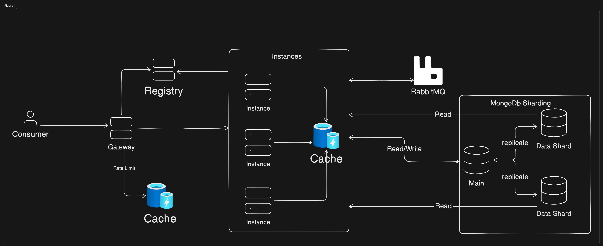

# Scale

## Code 

* Maybe use a search engine like ElasticSearch to search for the movies, instead of querying the database directly.
* Use WebFlux instead of WebMVC, since it is more efficient and can handle more requests per second, theoretically.
* The brand new Project Loom maybe can help with the concurrency, since it is a new way to handle threads (virtually), maybe it can handle more requests per second.
* Over even the good old Thread Pool Executor can help with the concurrency.

## Infrastructure

* Use a load balancer to distribute the requests between multiple instances of the application.
* Use a cache layer to avoid querying the database every time a movie is searched.
* A Gateway layer would be needed to implement the rate limit strategy, so free users would not degrade the performance of the application. (this can be implemented in the application layer as well but I think it is better to have a Gateway)
* We could split the application into a Search application and a Rate application, so we could scale them independently, maybe a Service Discovery would be nice in this case, to make it easier find instances for the Gateway and Load Balancer.
* Mongo Sharding would be nice to scale the database, Increased read/write throughput by distributing the dataset across multiple shards, both read and write operation capacity can be increased.
* A event asynchronous system for the Rate application would increase the throughput, since the rate operation would be asynchronous, however the consistency would be eventually consistent, so the top-rated movies would not be updated immediately.
* A event asynchronous system for the Search application would increase the throughput, since the search operation would be asynchronous, however the consistency would be eventually consistent, so the search would not be updated immediately.
  * Can be as simple as a fire and forget with Publishers (Web Flux) or a Thread Pool Executor or even something more robust like RabbitMQ or Kafka. RabbitMQ is the best fit here I think.

## Here you can find a system design diagram

