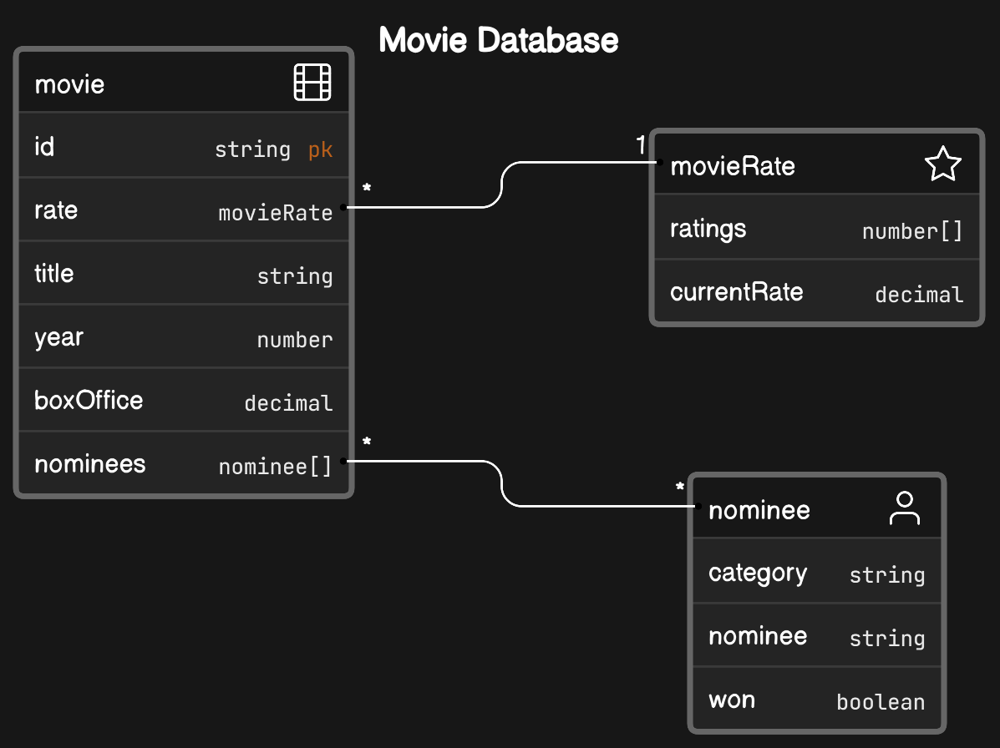

# Movies Api

This Spring Boot Api work as a backend for a movie catalog application.

This project was developed using Java 17, and Maven 3 and Spring Boot 3.

The endpoints are based on Movie title for simplicity while using the api, since it is the most common way to search for a movie, instead of using the movie id.

MongoDB is used because the data seems to be more document oriented, and it is easier to work with the data in this way.

The API Key is used for authentication and authorization, and it is passed as a header parameter, and it is validated by Spring Security via OncePerRequestFilter. 
I decided to not implement a API KEY generation, instead I am using a valid OMDB API Key, validated in a array for now, pretty naive, but I think you can understand the drill.

## Main Components

* A endpoint to rate movies given a movie title and a rate from 1 to 10.
* A top-rated movies endpoint that returns the top 10 (by default) rated movies ordered by box office value (desc).
* A endpoint to check if a movie ever won a best picture award, queried by movie title.
* A start-up process that loads the movies data from a csv file into a mongo database.
* I extended the MongoRepository to implement custom methods to query or aggregate the data, so I don't need to pollute the service layer with database queries. [MovieOperationsRepository](./src/main/java/com/backbase/movies/domain/movies/repository/MovieOperationsRepository.java) and [MovieOperationsRepositoryImpl](./src/main/java/com/backbase/movies/domain/movies/repository/MovieOperationsRepositoryImpl.java)

## Main Dependencies

* Spring boot MVC for the REST API.
* Spring Data Mongo for the database access.
* Spring Security for the authentication and authorization (API Key).
* Spring Actuator for the health check.
* Commons CSV for the csv file parsing.
* Hibernate Validator for the validation.
* Testcontainers for the integration tests.
* PMD for the static code analysis.

## Entities

## Best Picture Award Endpoint

## Rate Movie Endpoint

## Top Rated Movies Endpoint

## Seed Data Process

